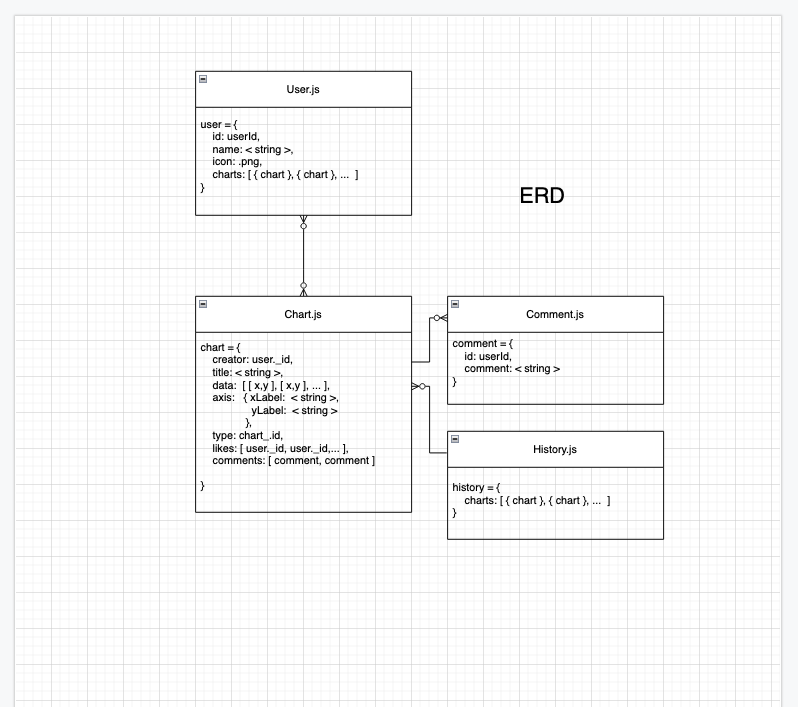

# quickCharts
### 07.25.2022
### James Jewitt [LinkedIn]( https://www.linkedin.com/in/james-jewitt/ ) |  [GitHub](https://github.com/jamest7783) 
  

***
#### Simply put, quickCharts is a fullstack application for logging and visualizing data using the chart.js library. Users are able to choose how they would like their data to be display, and with what chart type. Afterwards, users may choose to post their chart, view their chart independently, or return to home. If users would simply like to view past data that previous users had made, they can navigate to and search within all prior user-generated projects. 
  

***

#### Stack 
* MongoDB
* Express
* React
* Node.js
  

***
###    
###  Backend: MongoDB, Express   

  
###  Frontend: React 

  
###  Original File Structure 

***

### ***Future Updates***
- [ ] infinity

***

### ***Credits***

 